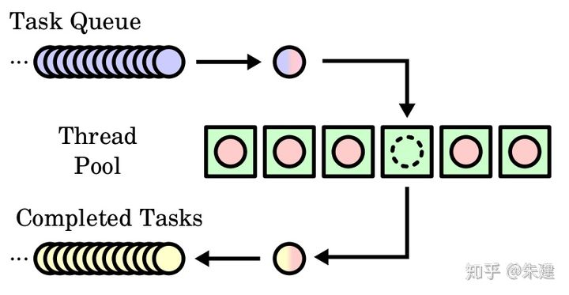

# 线程池

在TinyHttpdcpp中我们用C++实现了一个简单的多线程web服务器，每当服务器接收到一个请求时，它都会创建一个单独线程来处理请求。

第一个问题是创建线程所需的时间多少，以及线程在完成工作之后会被丢弃的事实。第二个问题更为麻烦，如果允许所有并发请求都通过新线程来处理，那么我们没有限制系统内的并发执行线程的数量。无限制的线程可能耗尽系统资源，如 CPU 时间和内存。解决这个问题的一种方法是使用**线程池**。

线程池的主要思想是：在进程开始时创建一定数量的线程，并加到池中以等待工作。当服务器收到请求时，它会唤醒池内的一个线程（如果有可用线程），并将需要服务的请求传递给它。一旦线程完成了服务，它会返回到池中再等待工作。如果池内没有可用线程，那么服务器会等待，直到有空线程为止。

但是在C++的`thread`里都是执行一个固定的task函数，执行结束后线程也自动结束，不能像`pthread.h`中把线程唤醒执行其它的任务。

所以在C++里的线程池的实现是**让每一个thread创建后，就去执行调度函数：循环获取task，然后执行。**

线程池具有以下优点：

1. 用现有线程服务请求比等待创建一个线程更快。
2. 线程池限制了任何时候可用线程的数量。这对那些不能支持大量并发线程的系统非常重要。
3. 将要执行任务从创建任务的机制中分离出来，允许我们采用不同策略运行任务。例如，任务可以被安排在某一个时间延迟后执行，或定期执行。

线程池主要有3个部分组成：

1. 任务队列
   存储需要处理的任务，外部程序通过线程池提供的API将待处理的任务添加到任务队列，或者从任务队列中删除一个任务。
2. 工作线程
   线程池维护一定数量的工作线程，负责从任务队列中取出任务，处理任务。如果任务队列为空，工作线程会被阻塞。有了新的任务后，由任务队列解除阻塞。
3. 管理者线程
   负责周期性的检查任务队列和忙状态的工作线程数量，当任务过多时可以适当地增加工作线程，当任务过少时可以适当地销毁线程。

